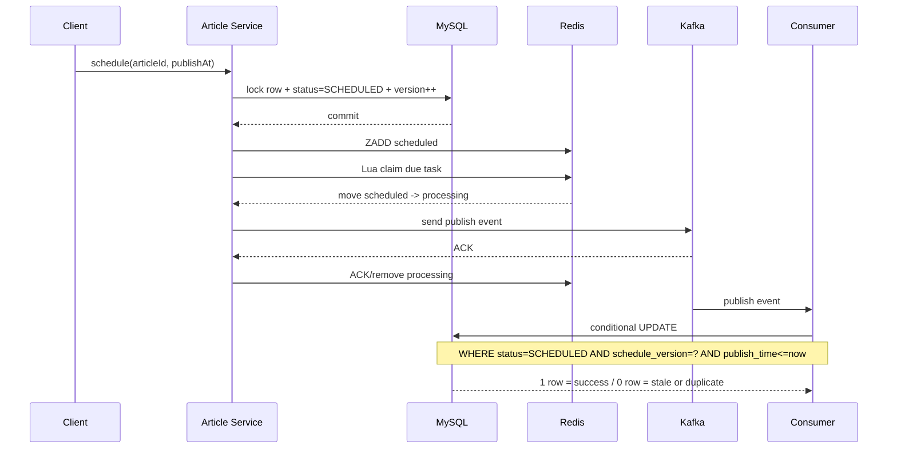

# Redis + Kafka 延时发布文章 SPEC

## 1. 目标

实现文章定时发布，要求支持：创建草稿、分页管理、设置/修改发布时间、取消定时、到点发布、多实例部署、Kafka 重复消息幂等、Redis/Kafka/应用短暂故障后的自动恢复，并提供与后端契约一致的 React 管理页面。

## 2. 核心语义

- **MySQL 是最终事实源（Source of Truth）**。
- **Redis ZSet 是时间索引，不是最终状态存储**。
- **Kafka 提供到期后的可靠异步事件传递**。
- 系统采用 **at-least-once + 幂等消费**，不依赖“恰好一次”假设。
- `schedule_version` 是业务版本号：每次重新定时或取消定时都会递增，使旧任务/旧 Kafka 消息自动失效。

## 3. Redis 状态机

```text
article:delay:scheduled
        |
        | Lua 原子 claim（到期）
        v
article:delay:processing -- Kafka ACK --> 删除
        |
        | Kafka send 失败
        +---------------------------> scheduled
        |
        | lease 超时（实例宕机等）
        +---------------------------> scheduled
```

Redis member：

```text
{articleId}:{scheduleVersion}:{publishAtEpochMillis}
```

## 4. 正常时序



## 5. 故障矩阵

| 故障点 | 结果 | 恢复机制 |
|---|---|---|
| DB commit 前服务异常 | 定时变更不生效 | DB 事务回滚 |
| DB commit 后、Redis 写入前异常 | DB 有任务，Redis 缺任务 | DB 补偿扫描恢复 ZSet |
| Redis claim 后服务宕机 | processing 中存在租约 | lease 到期自动回收 |
| Kafka send 失败 | 不确认 processing | NACK 回 scheduled |
| Kafka ACK 后 Redis ACK 失败 | 可能再次投递 | lease 回收 + DB 幂等 |
| Kafka 重复消费 | 消息重复 | conditional UPDATE 仅首次成功 |
| 用户修改发布时间 | 旧任务可能仍存在 | schedule_version 失效旧任务 |
| 用户取消定时 | 旧消息可能在途 | status + schedule_version 双重失效 |

## 6. 验收标准

- [x] 创建文章草稿。
- [x] 设置未来发布时间。
- [x] 修改发布时间后旧任务不能提前发布。
- [x] 取消定时后旧 Kafka 消息不能发布文章。
- [x] 多实例 Redis claim 不重复领取同一 member。
- [x] Kafka 生产失败会重新入队。
- [x] processing 租约超时自动恢复。
- [x] Redis 写入丢失可由 MySQL 补偿。
- [x] Kafka 消费端条件更新保证业务幂等。
- [x] Kafka retry topic + DLT。
- [x] Docker Compose 提供 MySQL、Redis、Kafka、Kafka UI。

## 7. React 管理端验收

- [x] React 18 + TypeScript + Ant Design。
- [x] 分页文章列表。
- [x] 按标题搜索。
- [x] 按 `DRAFT / SCHEDULED / PUBLISHED` 过滤。
- [x] 创建草稿。
- [x] 设置/修改定时发布时间。
- [x] 取消定时发布。
- [x] 查看文章详情。
- [x] Spring `ProblemDetail` 错误提示。
- [x] Vite 本地代理 `/api -> localhost:8080`。
- [x] Docker Nginx 代理 `/api -> app:8080`。
