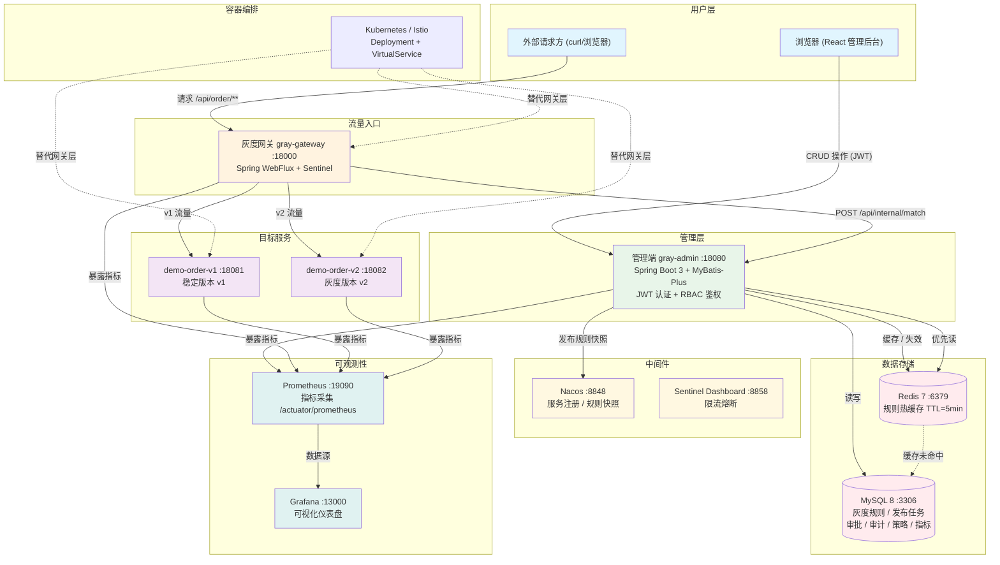
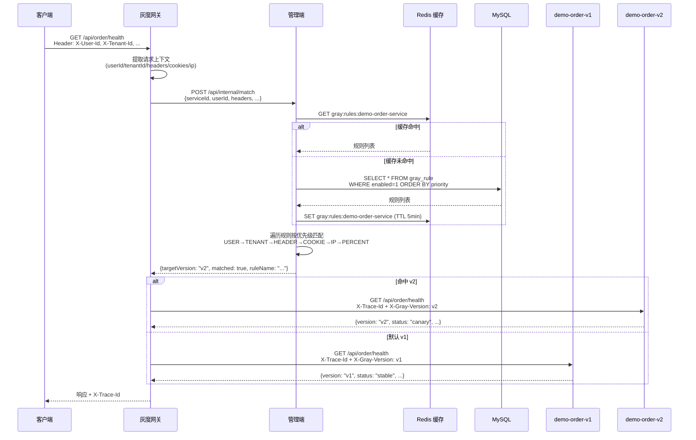
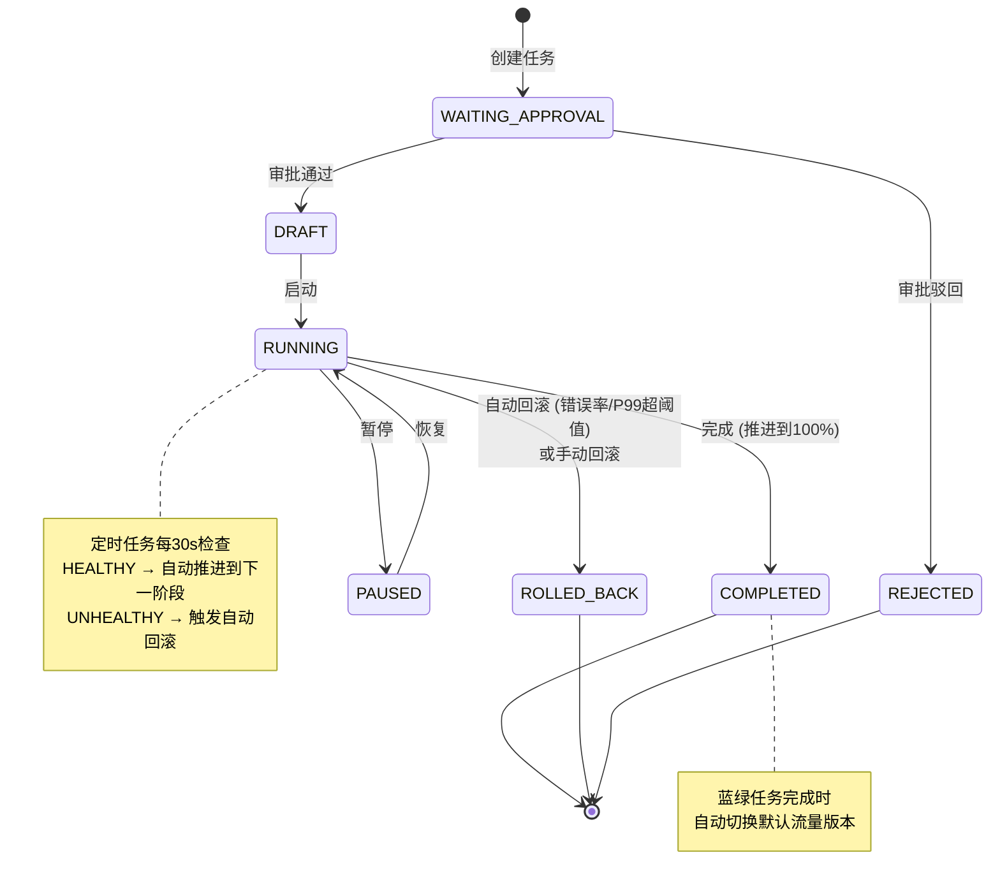

# 灰度发布管理平台

一套完整的、可本地运行的灰度发布管理平台 Demo，涵盖灰度规则管理、发布任务编排、审批流程、蓝绿部署、A/B 测试、自动回滚、监控告警等全链路功能。

> 详细代码介绍请参阅 [CODE_INTRO.md](./CODE_INTRO.md)

---

## 系统架构图



---

## 灰度路由数据流



---

## 发布任务生命周期



---

## 技术栈

| 层级 | 技术 | 版本 |
|---|---|---|
| 语言 | Java / JavaScript | 17 / ES2022 |
| 框架 | Spring Boot 3 + Spring Cloud Alibaba | 3.3.7 / 2023.0.3.2 |
| ORM | MyBatis-Plus | 3.5.9 |
| 数据库 | MySQL | 8.4 |
| 缓存 | Redis | 7.2 |
| 注册配置 | Nacos | 2.3.2 |
| 限流熔断 | Sentinel | 1.8.8 |
| 数据库迁移 | Flyway | 10.20.1 |
| 监控 | Prometheus + Grafana | 2.55.1 / 11.4.0 |
| 安全 | Spring Security + JWT | - |
| 前端 | React + Vite + Ant Design | 18 / 5 / 5 |
| 状态管理 | Zustand | - |
| 容器化 | Docker Compose + Kubernetes + Istio | - |

---

## 项目结构

```
gray-release-platform/
├── backend/
│   ├── gray-common/         # 公共模块 (DTO / 枚举 / 工具类)
│   ├── gray-admin/          # 管理端 (规则引擎 / 发布任务 / 审批 / 审计 / 诊断)
│   ├── gray-gateway/        # 灰度网关 (WebFlux 代理，调用管理端匹配接口)
│   ├── demo-order-v1/       # 示例订单服务 v1 (稳定版)
│   └── demo-order-v2/       # 示例订单服务 v2 (灰度版)
├── frontend/                # React 管理后台 (Ant Design + Zustand)
├── env/                     # 本地环境 (docker-compose.yml + 初始化脚本)
├── deploy/
│   ├── k8s/                 # Kubernetes / Istio 部署文件
│   └── postman/             # Postman 接口集合
└── CODE_INTRO.md            # 详细代码介绍
```

---

## 核心功能

### 灰度规则管理
- 支持 **8 种规则类型**: USER、TENANT、HEADER、COOKIE、IP、APP_VERSION、REGION、PERCENT
- 按优先级排序匹配，**精准规则优先、比例规则兜底**
- 规则冲突检测：同服务、同类型、同条件不可重复启用
- 规则变更自动清理 Redis 缓存，可一键发布到 Nacos

### 发布任务管理
- **三种策略**: CANARY (金丝雀)、BLUE_GREEN (蓝绿)、AB_TEST (A/B 测试)
- **七种状态**: WAITING_APPROVAL → DRAFT → RUNNING → PAUSED → COMPLETED → ROLLED_BACK / REJECTED
- **审批流**: 任务创建后进入待审批，审批通过才能启动
- **阶段推进**: 支持自定义阶段 `[1,5,20,50,100]`，健康时自动推进
- **自动回滚**: 错误率或 P99 延迟超阈值自动回滚，流量归零

### 安全认证
- JWT 登录认证 + RBAC 三级角色: `ADMIN`、`RELEASE_MANAGER`、`VIEWER`
- 读写分离权限控制

### 蓝绿部署
- 服务策略表控制默认版本，一键切流 Blue ↔ Green
- 蓝绿任务完成时自动切换默认流量版本

### A/B 测试
- 记录曝光和转化指标，前端实时计算转化率
- 支持自定义实验比例

### 可观测性
- **TraceId 透传**: 网关 → 管理端 → 目标服务全链路追踪
- **Prometheus**: 自动抓取各服务 `/actuator/prometheus` 指标
- **Grafana**: 自动导入数据源和基础大盘 `Gray Release Overview`
- **告警**: 事件落库 + Webhook 外发

### 灰度诊断
- 输入用户、租户、Header、Cookie 等条件，模拟匹配结果
- 显示命中的版本、规则名称和匹配原因

---

## 快速启动

### 一键启动 (Docker Compose)

```bash
cd env
docker compose up -d --build
```

### 启动后访问

| 服务 | 地址 | 说明 |
|---|---|---|
| 前端后台 | http://localhost:3000 | React 管理界面 |
| 管理端 API | http://localhost:18080 | 后端 REST API |
| 灰度网关 | http://localhost:18000 | 流量入口 |
| Nacos | http://localhost:8848/nacos | 服务注册与配置 |
| Sentinel | http://localhost:8858 | 限流熔断控制台 |
| Prometheus | http://localhost:19090 | 指标采集 |
| Grafana | http://localhost:13000 | 可视化大盘 |

### 演示账号

| 用户 | 密码 | 角色 | 权限 |
|---|---|---|---|
| `admin` | `admin123` | ADMIN | 全部操作 |
| `release` | `release123` | RELEASE_MANAGER | 读写 |
| `viewer` | `viewer123` | VIEWER | 只读 |

Grafana: `admin` / `admin123456`
MySQL: `gray` / `gray123456` (库: `gray_release`)

---

## 本地开发

```bash
# 后端
cd backend
mvn clean package -DskipTests

# 前端
cd frontend
npm install
npm run dev
```

---

## 验证指南

### 1. 灰度路由

默认种子规则:
- 用户 `1001` → v2
- Header `X-Gray: true` → v2
- 其余 → v1

```bash
# 默认 v1
curl http://localhost:18000/api/order/health

# 用户白名单 v2
curl -H "X-User-Id: 1001" http://localhost:18000/api/order/health

# Header 灰度 v2
curl -H "X-Gray: true" http://localhost:18000/api/order/health
```

### 2. 发布任务与自动回滚

1. 前端创建发布任务 → `WAITING_APPROVAL`
2. 审批流点击"通过" → `DRAFT`
3. 点击"开始" → `RUNNING`
4. 点击"异常"上报 `errorRate=0.12, p99=1800ms` → 自动 `ROLLED_BACK`

### 3. 蓝绿切流

1. 蓝绿/A-B 页面 → 点击"切 Green"
2. 不带灰度 Header 请求网关 → 默认返回 `v2`
3. 点击"切 Blue" → 恢复 `v1`

### 4. A/B 测试

1. 开启 A/B 开关，设置 B 版本比例
2. 记录曝光和转化数据
3. 表格展示曝光数、转化数和转化率

---

## 面试讲述要点

1. **管理端**通过 MySQL 持久化灰度规则、发布任务、审批单和审计日志
2. **JWT + RBAC** 控制规则、发布、审批等敏感操作
3. 规则变更写 MySQL → 清理 Redis 缓存 → 可发布到 Nacos 快照
4. **网关**提取请求上下文 (用户/租户/Header/Cookie/IP)，调用管理端匹配接口
5. **规则引擎**按优先级匹配：白名单/精准规则优先，比例规则兜底
6. 命中后网关转发到对应版本服务，**透传 TraceId**
7. 发布任务**先审批后启动**，运行中可分阶段自动推进
8. **自动回滚**基于错误率和 P99 延迟阈值，异常时流量归零
9. 蓝绿发布通过 `service_policy` 表控制默认版本，完成时自动切流
10. A/B 测试通过 `ab_metric` 表记录曝光和转化
11. Nacos 存规则快照，Redis 存热路径缓存，MySQL 为最终一致源
12. Prometheus 拉取指标，Grafana 自动导入基础大盘
13. K8s/Istio 文件支持生产级 Header 灰度和权重灰度
