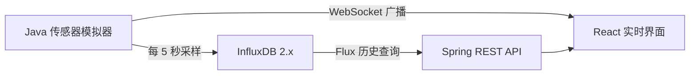

# InfluxDB 物联网温度监控平台

一个可直接运行的 Java + React 示例：Java 模拟 5 个温度传感器，将时序数据写入 InfluxDB 2.x，同时通过原生 WebSocket 推送给 React 实时展示。

## 数据链路



实时消息格式：

```json
{
  "type": "temperature",
  "data": {
    "sensorId": "SN-10001",
    "sensorName": "产线A-电机1",
    "location": "一号车间",
    "value": 24.6,
    "status": "NORMAL",
    "timestamp": "2026-07-13T10:20:30Z"
  },
  "sentAt": "2026-07-13T10:20:30Z"
}
```

## 一键启动

要求：Docker Desktop 24+，Docker Compose v2。

```bash
cp .env .env
docker compose up -d --build
```

Windows PowerShell：

```powershell
Copy-Item .env.example .env
docker compose up -d --build
```

访问地址：

- React 监控台：http://localhost:3000
- InfluxDB 控制台：http://localhost:8086
- Java 健康检查：http://localhost:8080/actuator/health
- WebSocket：`ws://localhost:3000/ws/temperature`（Nginx 转发）

InfluxDB 默认账户是 `admin / Admin123456!`。正式环境务必修改 `.env` 中的密码和 Token。

首次启动时会自动生成最近 24 小时、5 个设备、每 5 分钟一条的历史数据，共 1440 个点；之后每 5 秒产生实时数据。

## API

| 方法 | 地址 | 说明 |
|---|---|---|
| GET | `/api/sensors` | 传感器列表 |
| GET | `/api/temperature/latest` | 每个设备最新值 |
| GET | `/api/temperature/history?sensorId=SN-10001&hours=24` | InfluxDB 历史趋势 |
| POST | `/api/simulator/start` | 启动模拟器 |
| POST | `/api/simulator/stop` | 暂停模拟器 |
| POST | `/api/simulator/generate/SN-10001` | 手动生成一次采样 |
| GET | `/api/system/status` | 系统及 WebSocket 连接状态 |

## 本地开发

仅启动 InfluxDB：

```bash
docker compose up -d influxdb
mvn spring-boot:run
```

另开终端启动前端：

```bash
cd frontend
npm install
npm run dev
```

Vite 会把 `/api` 和 `/ws` 代理到 `localhost:8080`。

## 关键设计

- InfluxDB measurement：`temperature`
- Tags：`sensorId`、`sensorName`、`location`、`status`
- Field：`value`
- 时间精度：毫秒
- 保留策略：30 天
- WebSocket 使用线程安全 Session 集合，断线客户端自动清理；前端 3 秒自动重连
- 趋势切换会查询 InfluxDB，实时点则直接增量加入当前曲线

停止并保留数据：`docker compose down`。如需连同 InfluxDB 数据一起删除：`docker compose down -v`。
