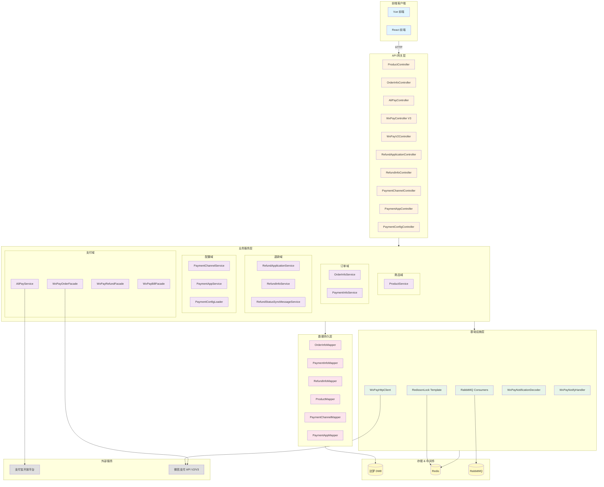
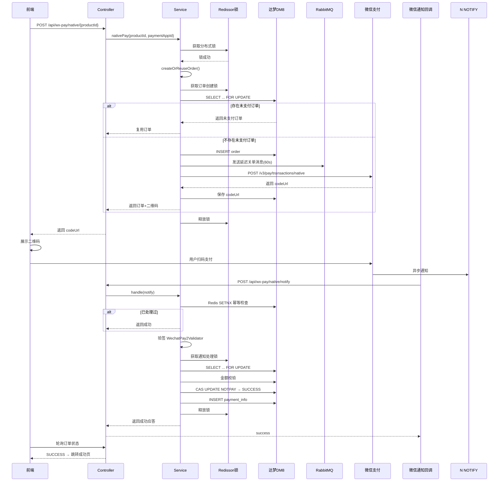
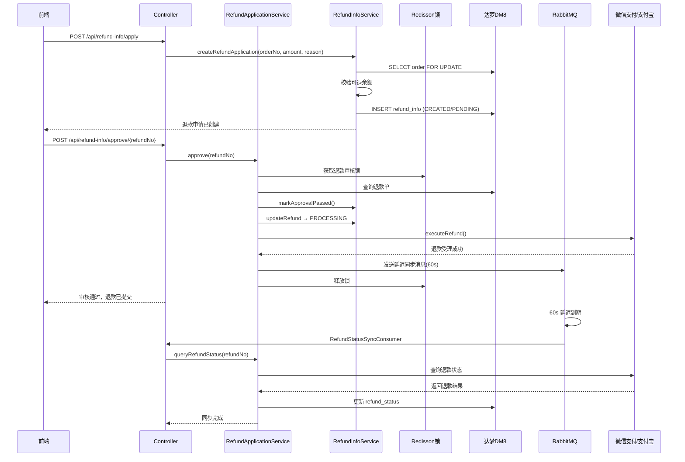
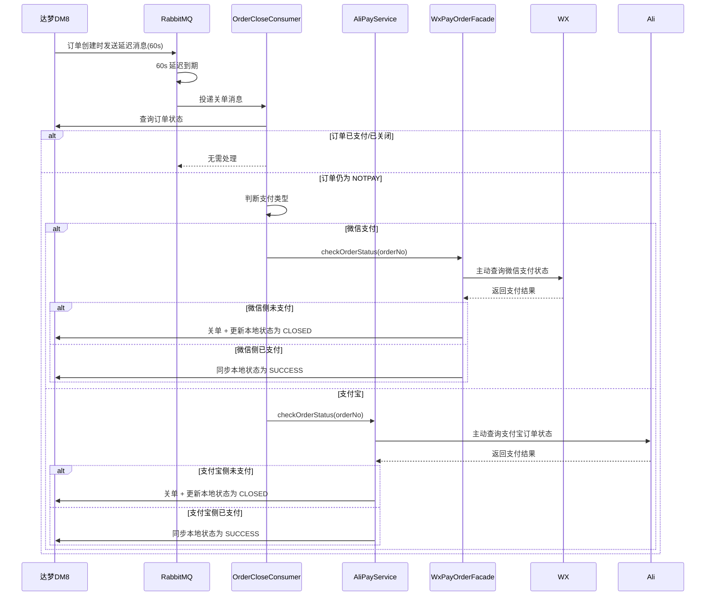
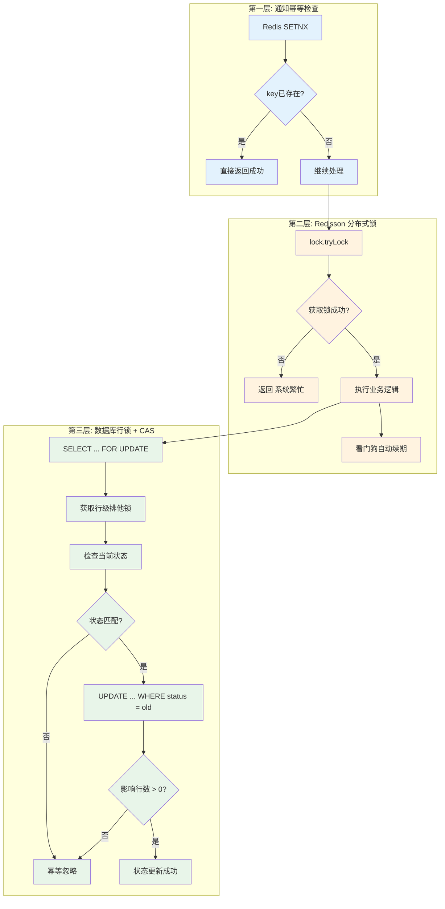
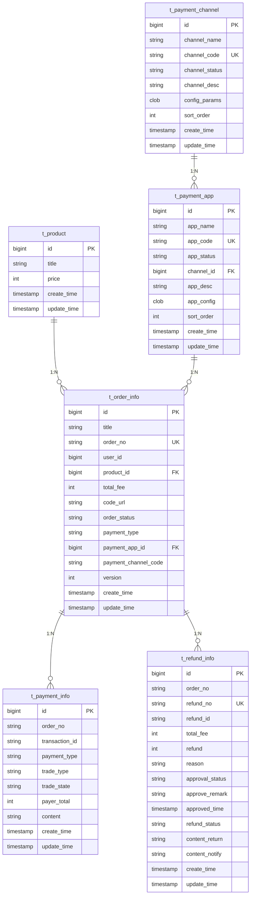

# 支付 Demo V5 — 项目架构图

## 系统总览



## 支付流程



## 退款流程



## 延迟关单流程



## 三层并发控制



## 配置加载机制

```mermaid
graph LR
    subgraph StaticConfig["静态配置"]
        SP[wxpay.properties]
        AP[application.yml alipay节点]
    end

    subgraph DynamicConfig["动态配置 数据库"]
        PC[t_payment_channel]
        PA[t_payment_app]
    end

    subgraph Loader["PaymentConfigLoader"]
        PCL[@PostConstruct init]
        RELOAD[reloadConfigs]
    end

    subgraph Cache["内存缓存"]
        CC[appConfigCache ConcurrentHashMap]
        CHC[channelCache ConcurrentHashMap]
        VC[verifierCache ConcurrentHashMap]
    end

    subgraph Usage["使用场景"]
        WXV3[微信V3: 动态构建HTTP Client]
        WXV2[微信V2: 静态WxPayConfig]
        ALI[支付宝: buildAlipayClient 动态构建]
    end

    SP --> PCL
    AP --> PCL
    PC --> PCL
    PA --> PCL
    PCL --> CC
    PCL --> CHC
    CC --> WXV3
    CC --> ALI
    SP --> WXV2

    classDef static fill:#fff9c4
    classDef dynamic fill:#e1f5fe
    classDef loader fill:#f3e5f5
    classDef cache fill:#e8f5e9
    classDef usage fill:#fce4ec
    class SP,AP static
    class PC,PA dynamic
    class PCL,RELOAD loader
    class CC,CHC,VC cache
    class WXV3,WXV2,ALI usage
```

## 数据库实体关系


