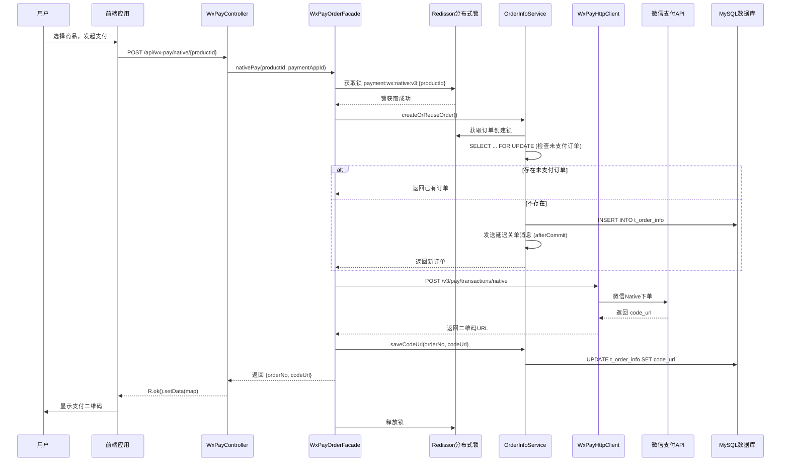
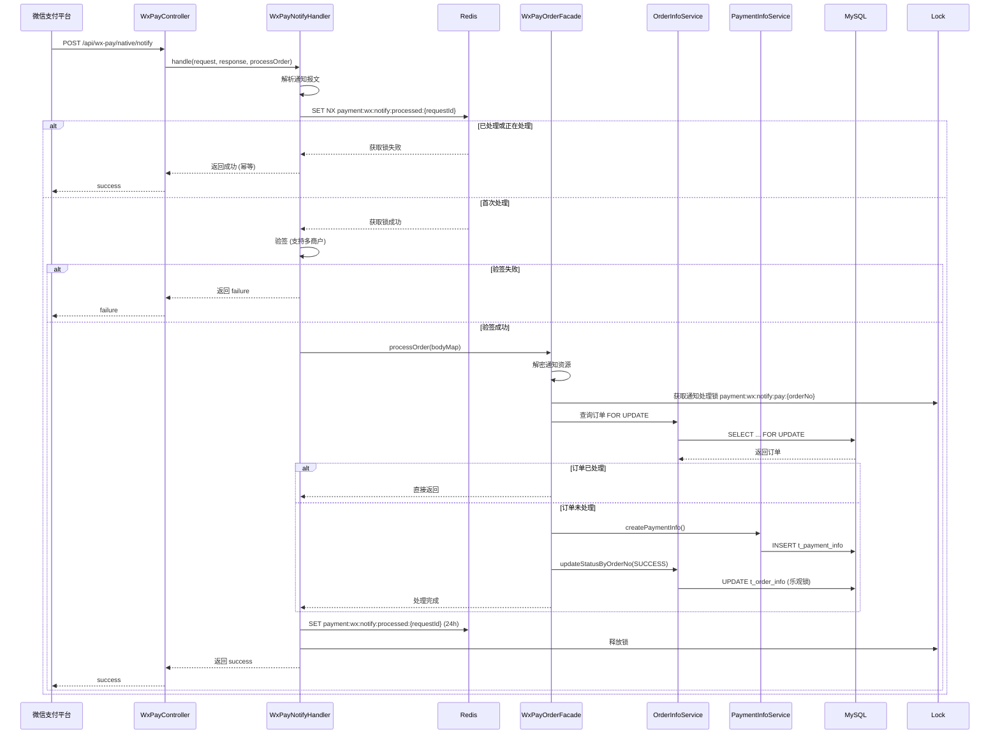
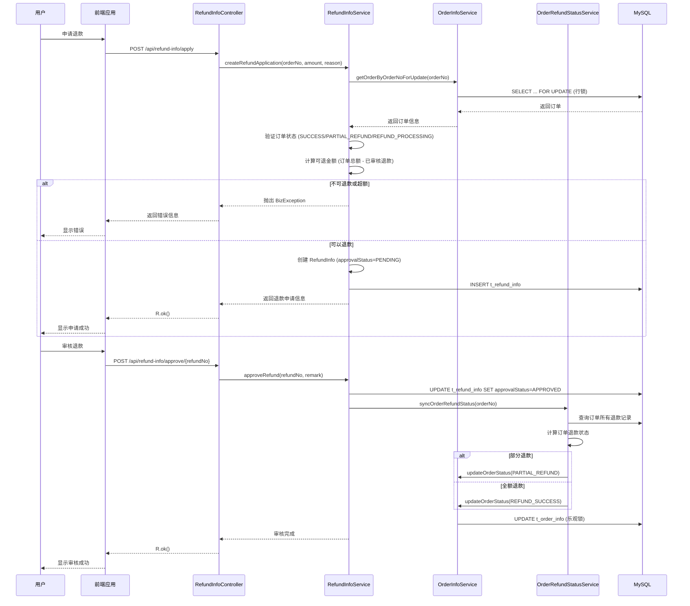
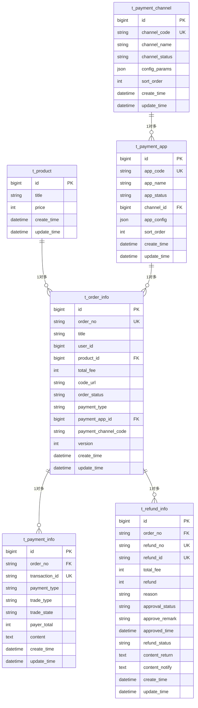
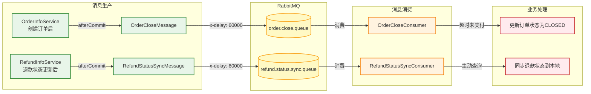
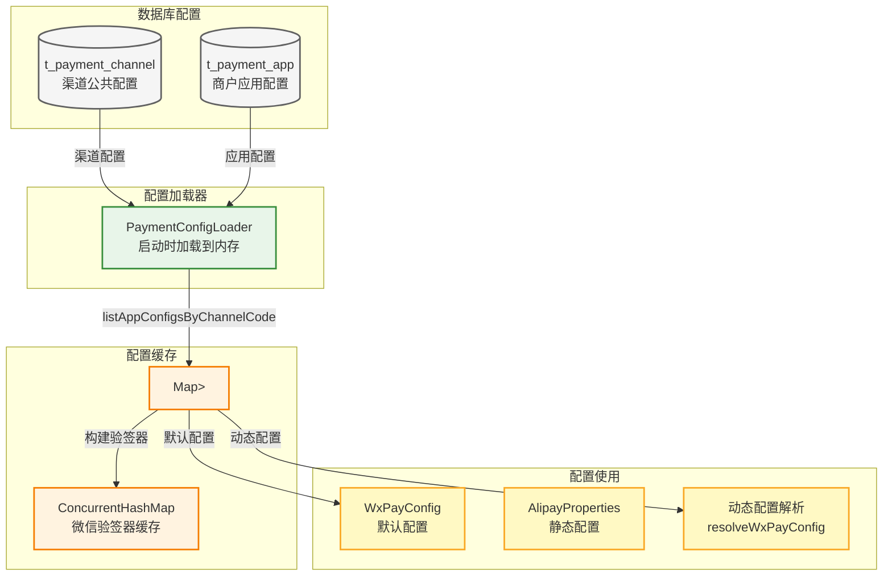

# Payment Demo 支付系统架构图

## 架构总览

```mermaid
graph TB
    subgraph Frontend["前端应用层"]
        ReactApp["React App<br/>(React 18 + Ant Design)"]
        VueApp["Vue App<br/>(Vue 2 + Element UI)"]
    end

    subgraph Controller["Controller层 (API入口)"]
        WxPayCtrl["WxPayController<br/>微信支付V3"]
        WxPayV2Ctrl["WxPayV2Controller<br/>微信支付V2"]
        AliPayCtrl["AliPayController<br/>支付宝支付"]
        OrderCtrl["OrderInfoController<br/>订单管理"]
        RefundCtrl["RefundInfoController<br/>退款管理"]
        ConfigCtrl["PaymentConfigController<br/>配置管理"]
        ProductCtrl["ProductController<br/>商品管理"]
    end

    subgraph Facade["Facade层"]
        WxOrderFacade["WxPayOrderFacade<br/>微信订单门面"]
        WxRefundFacade["WxPayRefundFacade<br/>微信退款门面"]
        WxBillFacade["WxPayBillFacade<br/>微信对账门面"]
        WxNotifyHandler["WxPayNotifyHandler<br/>统一通知处理器"]
    end

    subgraph Service["Service层 (业务逻辑)"]
        OrderService["OrderInfoService<br/>订单服务"]
        PaymentService["PaymentInfoService<br/>支付服务"]
        RefundService["RefundInfoService<br/>退款服务"]
        ProductService["ProductService<br/>商品服务"]
        AliPayService["AliPayService<br/>支付宝服务"]
        WxPayHTTPClient["WxPayHttpClient<br/>微信HTTP客户端"]
        OrderRefundStatus["OrderRefundStatusService<br/>订单退款状态"]
    end

    subgraph Lock["并发控制层"]
        RedissonLock["Redisson分布式锁<br/>(看门狗自动续期)"]
        NotifyIdempotent["通知幂等控制<br/>(Redis SET NX 24h)"]
        DBRowLock["数据库行锁<br/>(SELECT FOR UPDATE)"]
        OptimisticLock["乐观锁<br/>(@Version)"]
    end

    subgraph MQ["消息队列层 (RabbitMQ)"]
        OrderCloseMsg["OrderCloseMessage<br/>订单关闭消息"]
        RefundSyncMsg["RefundStatusSyncMessage<br/>退款同步消息"]
        OrderCloseConsumer["OrderCloseConsumer<br/>订单关闭消费者"]
        RefundSyncConsumer["RefundStatusSyncConsumer<br/>退款同步消费者"]
    end

    subgraph Mapper["Mapper层 (数据访问)"]
        OrderMapper["OrderInfoMapper"]
        PaymentMapper["PaymentInfoMapper"]
        RefundMapper["RefundInfoMapper"]
        ProductMapper["ProductMapper"]
        AppMapper["PaymentAppMapper"]
        ChannelMapper["PaymentChannelMapper"]
    end

    subgraph Database["数据存储层"]
        MySQL[("MySQL数据库<br/>payment_demo_v1")]
        Redis[("Redis缓存<br/>分布式锁/幂等")]
        RabbitMQ[("RabbitMQ<br/>延迟消息队列")]
    end

    subgraph External["外部支付平台"]
        WxPayAPI[("微信支付API<br/>api.mch.weixin.qq.com")]
        AliPayAPI[("支付宝API<br/>openapi.alipay.com")]
    end

    ReactApp -->|HTTP/REST| WxPayCtrl
    ReactApp -->|HTTP/REST| WxPayV2Ctrl
    ReactApp -->|HTTP/REST| AliPayCtrl
    ReactApp -->|HTTP/REST| OrderCtrl
    ReactApp -->|HTTP/REST| RefundCtrl
    VueApp -->|HTTP/REST| WxPayCtrl
    VueApp -->|HTTP/REST| WxPayV2Ctrl
    VueApp -->|HTTP/REST| AliPayCtrl

    WxPayCtrl -->|委托| WxOrderFacade
    WxPayCtrl -->|委托| WxRefundFacade
    WxPayCtrl -->|委托| WxBillFacade
    WxPayCtrl -->|支付回调| WxNotifyHandler
    WxPayV2Ctrl -->|委托| WxOrderFacade
    AliPayCtrl -->|调用| AliPayService
    OrderCtrl -->|调用| OrderService
    RefundCtrl -->|调用| RefundService
    ProductCtrl -->|调用| ProductService

    WxOrderFacade -->|实现| WxPayOrderService
    WxRefundFacade -->|实现| WxPayRefundService
    WxNotifyHandler -->|处理通知| WxPayOrderService

    WxPayOrderService -->|依赖| OrderService
    WxPayOrderService -->|依赖| PaymentService
    WxPayOrderService -->|HTTP调用| WxPayHTTPClient
    WxPayRefundService -->|依赖| RefundService
    WxPayRefundService -->|HTTP调用| WxPayHTTPClient
    AliPayService -->|HTTP调用| AliPayHTTPClient

    OrderService -->|并发控制| RedissonLock
    OrderService -->|发送消息| OrderCloseMsg
    OrderService -->|行锁| DBRowLock
    RefundService -->|状态计算| OrderRefundStatus
    WxPayOrderService -->|并发控制| RedissonLock
    WxNotifyHandler -->|幂等检查| NotifyIdempotent

    OrderCloseMsg -->|延迟消息| RabbitMQ
    RefundSyncMsg -->|延迟消息| RabbitMQ
    RabbitMQ -->|消费| OrderCloseConsumer
    RabbitMQ -->|消费| RefundSyncConsumer
    OrderCloseConsumer -->|更新状态| OrderService
    RefundSyncConsumer -->|同步状态| RefundService

    OrderService -->|MyBatis-Plus| OrderMapper
    PaymentService -->|MyBatis-Plus| PaymentMapper
    RefundService -->|MyBatis-Plus| RefundMapper
    ProductService -->|MyBatis-Plus| ProductMapper
    AppMapper -->|配置查询| PaymentConfigLoader
    ChannelMapper -->|渠道查询| PaymentConfigLoader

    OrderMapper -->|持久化| MySQL
    PaymentMapper -->|持久化| MySQL
    RefundMapper -->|持久化| MySQL
    ProductMapper -->|持久化| MySQL
    AppMapper -->|持久化| MySQL
    ChannelMapper -->|持久化| MySQL
    RedissonLock -->|Redis协议| Redis
    NotifyIdempotent -->|Redis协议| Redis

    WxPayHTTPClient -.->|HTTPS| WxPayAPI
    AliPayHTTPClient -.->|HTTPS| AliPayAPI
    WxPayAPI -.->|支付回调| WxPayCtrl
    WxPayAPI -.->|退款回调| WxPayCtrl
    AliPayAPI -.->|支付回调| AliPayCtrl

    classDef frontend fill:#e3f2fd,stroke:#1976d2,stroke-width:2px
    classDef controller fill:#fff3e0,stroke:#f57c00,stroke-width:2px
    classDef facade fill:#f3e5f5,stroke:#7b1fa2,stroke-width:2px
    classDef service fill:#e8f5e9,stroke:#388e3c,stroke-width:2px
    classDef lock fill:#ffebee,stroke:#c62828,stroke-width:2px
    classDef mq fill:#fff9c4,stroke:#f9a825,stroke-width:2px
    classDef mapper fill:#e0f2f1,stroke:#00695c,stroke-width:2px
    classDef database fill:#f5f5f5,stroke:#616161,stroke-width:2px
    classDef external fill:#eceff1,stroke:#455a64,stroke-width:2px,stroke-dasharray: 5 5

    class ReactApp,VueApp frontend
    class WxPayCtrl,WxPayV2Ctrl,AliPayCtrl,OrderCtrl,RefundCtrl,ConfigCtrl,ProductCtrl controller
    class WxOrderFacade,WxRefundFacade,WxBillFacade,WxNotifyHandler facade
    class OrderService,PaymentService,RefundService,ProductService,AliPayService,WxPayHTTPClient,OrderRefundStatus service
    class RedissonLock,NotifyIdempotent,DBRowLock,OptimisticLock lock
    class OrderCloseMsg,RefundSyncMsg,OrderCloseConsumer,RefundSyncConsumer mq
    class OrderMapper,PaymentMapper,RefundMapper,ProductMapper,AppMapper,ChannelMapper mapper
    class MySQL,Redis,RabbitMQ database
    class WxPayAPI,AliPayAPI external
```



## 核心业务流程

### 1. 微信支付V3扫码支付流程



### 2. 微信支付回调处理流程



### 3. 退款申请与审核流程



## 数据库实体关系



## 并发控制架构

```mermaid
graph LR
    subgraph Layer1["第一层：通知幂等检查"]
        A[Redis SET NX<br/>notifyId + 24h过期]
    end

    subgraph Layer2["第二层：分布式锁"]
        B[Redisson分布式锁<br/>看门狗自动续期]
    end

    subgraph Layer3["第三层：数据库锁"]
        C[SELECT FOR UPDATE<br/>数据库行锁]
        D[UPDATE ... WHERE status = ...<br/>状态条件更新]
        E[@Version<br/>乐观锁]
    end

    A -->|防止重复通知| B
    B -->|防止并发操作| C
    C -->|防止脏写| D
    D -->|防止冲突更新| E

    classDef layer1 fill:#ffebee,stroke:#c62828,stroke-width:2px
    classDef layer2 fill:#fff3e0,stroke:#f57c00,stroke-width:2px
    classDef layer3 fill:#e8f5e9,stroke:#388e3c,stroke-width:2px

    class A layer1
    class B layer2
    class C,D,E layer3
```

## 消息队列流转



## 配置管理架构


