# Payment Demo 项目代码结构介绍

## 1. 项目概述

这是一个基于 Spring Boot 的企业级支付集成演示项目，集成了**微信支付 V2/V3** 和**支付宝沙箱**两大支付渠道，实现了完整的订单管理、支付流程、退款管理、对账管理等核心功能，并采用分布式锁、消息队列、乐观锁等企业级并发控制架构确保数据一致性。

项目同时提供 **React** 和 **Vue** 两套前端实现，方便开发者对比学习不同前端框架的接入方式。

---

## 2. 技术栈

### 2.1 后端技术栈

| 技术 | 版本 | 说明 |
|------|------|------|
| Spring Boot | 2.3.7.RELEASE | 核心框架 |
| Java | 21 | 开发语言（源码兼容 1.8） |
| MyBatis-Plus | 3.3.1 | ORM 框架，MyBatis 的增强 |
| MySQL | 5.7+ | 关系型数据库 |
| Redis | 5.0+ | 缓存 / 分布式锁 |
| Redisson | 3.16.8 | 分布式锁框架（看门狗自动续期） |
| RabbitMQ | 3.7+ | 消息队列（延迟消息：订单关闭、退款状态同步） |
| Swagger | 2.7.0 | API 文档 |
| 微信支付 SDK (V3) | 0.3.0 | 微信支付 V3 官方 SDK |
| 微信支付 SDK (V2) | 0.0.3 | 微信支付 V2 官方 SDK |
| 支付宝 SDK | 4.22.57.ALL | 支付宝官方 Java SDK |
| Lombok | 1.18.32 | 简化 Java 代码 |

### 2.2 前端技术栈

| 项目 | 框架 | UI 组件库 | 构建工具 | 路由 | HTTP 客户端 |
|------|------|----------|----------|------|------------|
| payment-demo-react | React 18.3.1 | Ant Design 5.21.6 | Vite 5.4.8 | React Router 6.26.2 | Axios 1.7.7 |
| payment-demo-vue | Vue 2.6.11 | Element UI 2.15.6 | Vue CLI 4.5.0 | Vue Router 3.5.3 | Axios 0.24.0 |

---

## 3. 项目结构

```
payment-demo-java/
├── AGENTS.md                              # AI 开发规则
├── CHARACTERIZATION_TESTS.md              # 特征测试清单
├── CURRENT_BEHAVIOR_SPEC.md               # 当前行为规格
├── TEST_MAPPING.md                         # 测试与现状映射表
├── spec/                                   # Spec 状态账本
│   ├── governance/                         # 长期治理规则
│   ├── planned/                            # 已设计未实现 Spec
│   ├── implemented/                        # 已实现 Spec
│   └── archived/                           # 已废弃 Spec
├── payment-demo/                           # 后端 Spring Boot 项目
│   ├── src/
│   │   ├── main/
│   │   │   ├── java/cc/ivera/
│   │   │   │   ├── PaymentDemoApplication.java     # 启动类
│   │   │   │   ├── config/                          # 配置类
│   │   │   │   ├── controller/                      # 控制层（API 入口）
│   │   │   │   ├── dto/                             # 数据传输对象
│   │   │   │   ├── entity/                          # 数据库实体
│   │   │   │   ├── enums/                           # 枚举类型
│   │   │   │   ├── exception/                       # 异常定义
│   │   │   │   ├── handler/                         # 全局异常处理器
│   │   │   │   ├── lock/                            # 分布式锁模板
│   │   │   │   ├── mapper/                          # MyBatis Mapper 接口
│   │   │   │   ├── mq/                              # 消息队列（消费者/消息体）
│   │   │   │   ├── service/                         # 业务逻辑层
│   │   │   │   ├── util/                            # 工具类
│   │   │   │   └── vo/                              # 视图对象（统一响应）
│   │   │   └── resources/
│   │   │       ├── mapper/                          # MyBatis XML 映射文件
│   │   │       ├── application.yml                  # 主配置文件
│   │   │       ├── wxpay.properties                 # 微信支付配置
│   │   │       ├── alipay-sandbox.properties        # 支付宝沙箱配置
│   │   │       └── apiclient_key.pem                # 微信支付商户私钥
│   │   └── test/                                      # 测试代码
│   ├── sql/
│   │   └── payment-demo.sql                          # 数据库初始化脚本
│   ├── docs/
│   │   └── RABBITMQ_OPERATIONS.md                    # RabbitMQ 运维文档
│   └── pom.xml                                        # Maven 依赖配置
├── payment-demo-react/                     # React 前端
│   ├── src/
│   │   ├── api/                              # API 请求封装
│   │   ├── pages/                            # 页面组件
│   │   ├── components/                       # 公共组件
│   │   ├── utils/                            # 工具函数
│   │   └── assets/                           # 静态资源
│   └── package.json
└── payment-demo-vue/                       # Vue 前端
    ├── src/
    │   ├── api/
    │   ├── views/
    │   ├── components/
    │   ├── router/
    │   ├── utils/
    │   └── assets/
    └── package.json
```

---

## 4. 核心模块说明

### 4.1 后端分层架构

```mermaid
graph TB
    subgraph Controller["Controller 层（API 入口）"]
        C1[ProductController]
        C2[OrderInfoController]
        C3[WxPayController]
        C4[WxPayV2Controller]
        C5[AliPayController]
        C6[RefundInfoController]
        C7[ReconciliationController]
        C8[PaymentConfigController]
    end

    subgraph Facade["Facade 层（对外门面）"]
        F1[WxPayOrderFacade]
        F2[WxPayRefundFacade]
        F3[WxPayBillFacade]
        F4[WxPayNotifyHandler]
    end

    subgraph Service["Service 层（业务逻辑）"]
        S1[ProductService]
        S2[OrderInfoService]
        S3[WxPayOrderService]
        S4[WxPayRefundService]
        S5[WxPayBillService]
        S6[AliPayService]
        S7[RefundInfoService]
        S8[ReconciliationService]
        S9[PaymentConfigLoader]
    end

    subgraph Mapper["Mapper 层（数据访问）"]
        M1[ProductMapper]
        M2[OrderInfoMapper]
        M3[PaymentInfoMapper]
        M4[RefundInfoMapper]
        M5[ReconciliationMapper]
        M6[PaymentAppMapper]
    end

    subgraph Entity["Entity 层（数据模型）"]
        E1[Product]
        E2[OrderInfo]
        E3[PaymentInfo]
        E4[RefundInfo]
        E5[Reconciliation]
        E6[ReconciliationDetail]
    end

    Controller --> Facade
    Controller --> Service
    Facade --> Service
    Service --> Mapper
    Mapper --> Entity
```



### 4.2 核心功能模块

#### 4.2.1 订单管理（OrderInfo）
- **文件**：[OrderInfoController.java](file:///d:/code/demo/springboot-payment/payment-demo-java/payment-demo/src/main/java/cc/ivera/controller/OrderInfoController.java)、[OrderInfoServiceImpl.java](file:///d:/code/demo/springboot-payment/payment-demo-java/payment-demo/src/main/java/cc/ivera/service/impl/OrderInfoServiceImpl.java)
- **功能**：创建订单、复用未支付订单、订单状态查询
- **关键特性**：
  - 分布式锁防止重复创建订单（锁 Key：`payment:create:order:{productId}:{paymentType}:{paymentAppId}`）
  - 数据库行锁（`SELECT ... FOR UPDATE`）保证并发安全
  - 乐观锁（`@Version`）防止并发更新冲突
  - 订单创建后发送延迟消息，超时自动关闭

#### 4.2.2 微信支付（V3）
- **文件**：[WxPayController.java](file:///d:/code/demo/springboot-payment/payment-demo-java/payment-demo/src/main/java/cc/ivera/controller/WxPayController.java)、[WxPayOrderService.java](file:///d:/code/demo/springboot-payment/payment-demo-java/payment-demo/src/main/java/cc/ivera/service/impl/wxpay/WxPayOrderService.java)
- **功能**：Native 下单、支付通知、订单查询、退款申请、退款查询、账单下载
- **通知处理**：[WxPayNotifyHandler.java](file:///d:/code/demo/springboot-payment/payment-demo-java/payment-demo/src/main/java/cc/ivera/controller/support/WxPayNotifyHandler.java) 统一处理 V3 支付/退款通知
- **幂等控制**：基于 `requestId` 的 Redis `SET NX` 防止重复通知处理

#### 4.2.3 微信支付（V2）
- **文件**：[WxPayV2Controller.java](file:///d:/code/demo/springboot-payment/payment-demo-java/payment-demo/src/main/java/cc/ivera/controller/WxPayV2Controller.java)
- **功能**：V2 版本的 Native 下单、通知处理
- **格式**：请求/响应均为 XML 格式

#### 4.2.4 支付宝支付
- **文件**：[AliPayController.java](file:///d:/code/demo/springboot-payment/payment-demo-java/payment-demo/src/main/java/cc/ivera/controller/AliPayController.java)、[AliPayServiceImpl.java](file:///d:/code/demo/springboot-payment/payment-demo-java/payment-demo/src/main/java/cc/ivera/service/impl/AliPayServiceImpl.java)
- **功能**：PC 网站支付、支付通知、订单查询、退款
- **环境**：沙箱环境（`openapi-sandbox.dl.alipaydev.com`）

#### 4.2.5 退款管理
- **文件**：[RefundInfoController.java](file:///d:/code/demo/springboot-payment/payment-demo-java/payment-demo/src/main/java/cc/ivera/controller/RefundInfoController.java)、[RefundInfoServiceImpl.java](file:///d:/code/demo/springboot-payment/payment-demo-java/payment-demo/src/main/java/cc/ivera/service/impl/RefundInfoServiceImpl.java)
- **功能**：退款申请、退款审核、退款状态同步
- **审批流程**：退款申请 → 管理员审核 → 调用渠道退款接口 → 异步通知结果
- **状态同步**：退款状态通过 RabbitMQ 延迟消息定期同步

#### 4.2.6 支付对账（新增）
- **文件**：[ReconciliationController.java](file:///d:/code/demo/springboot-payment/payment-demo-java/payment-demo/src/main/java/cc/ivera/controller/ReconciliationController.java)、[ReconciliationServiceImpl.java](file:///d:/code/demo/springboot-payment/payment-demo-java/payment-demo/src/main/java/cc/ivera/service/impl/reconciliation/ReconciliationServiceImpl.java)
- **功能**：
  - 手动触发对账 / 定时自动对账（微信 2:00，支付宝 2:30）
  - 下载渠道账单（微信/支付宝 CSV）
  - 解析账单并与本地订单匹配
  - 识别差异：漏单、多单、金额不符、状态不符
  - 生成对账报告，支持 CSV 导出
- **并发控制**：Redis 分布式锁防止同一对账任务并发执行
- **幂等控制**：同一日期、渠道、应用的对账任务不重复执行（基于 `billHash`）

#### 4.2.7 支付配置管理
- **文件**：[PaymentConfigController.java](file:///d:/code/demo/springboot-payment/payment-demo-java/payment-demo/src/main/java/cc/ivera/controller/PaymentConfigController.java)、[PaymentConfigLoader.java](file:///d:/code/demo/springboot-payment/payment-demo-java/payment-demo/src/main/java/cc/ivera/config/PaymentConfigLoader.java)
- **数据模型**：
  - `t_payment_channel` - 支付渠道（微信、支付宝）
  - `t_payment_app` - 支付应用（渠道下的具体商户配置）
- **支持**：多商户、多渠道动态配置，无需硬编码

### 4.3 前端页面

#### React 前端（payment-demo-react）

| 页面 | 文件 | 路由 | 功能 |
|------|------|------|------|
| 首页（商品列表） | [Home.jsx](file:///d:/code/demo/springboot-payment/payment-demo-java/payment-demo-react/src/pages/Home.jsx) | `/` | 展示商品、选择支付方式、发起支付 |
| 我的订单 | [Orders.jsx](file:///d:/code/demo/springboot-payment/payment-demo-java/payment-demo-react/src/pages/Orders.jsx) | `/orders` | 订单列表、订单状态查询 |
| 支付成功 | [Success.jsx](file:///d:/code/demo/springboot-payment/payment-demo-java/payment-demo-react/src/pages/Success.jsx) | `/success` | 支付成功回调展示 |
| 下载账单 | [Download.jsx](file:///d:/code/demo/springboot-payment/payment-demo-java/payment-demo-react/src/pages/Download.jsx) | `/download` | 下载渠道对账单 |
| 支付配置 | [PaymentConfig.jsx](file:///d:/code/demo/springboot-payment/payment-demo-java/payment-demo-react/src/pages/PaymentConfig.jsx) | `/payment-config` | 管理支付渠道和应用配置 |
| 对账管理 | [Reconciliation.jsx](file:///d:/code/demo/springboot-payment/payment-demo-java/payment-demo-react/src/pages/Reconciliation.jsx) | `/reconciliation` | 对账记录查询、手动对账、查看明细、导出报告 |

#### Vue 前端（payment-demo-vue）

页面结构与 React 版一一对应，使用 Element UI 组件。

---

## 5. 数据库设计

### 5.1 核心数据表

| 表名 | 说明 | 关键字段 |
|------|------|---------|
| `t_product` | 商品表 | id, title, price, status |
| `t_order_info` | 订单表 | order_no, product_id, total_fee, order_status, payment_type, payment_app_id, version |
| `t_payment_info` | 支付流水表 | transaction_id, order_no, payment_type, trade_state, payer_total |
| `t_refund_info` | 退款表 | refund_no, order_no, refund_fee, refund_status, approval_status |
| `t_payment_channel` | 支付渠道表 | channel_code(WXPAY/ALIPAY), channel_name, channel_status, config_params |
| `t_payment_app` | 支付应用表 | app_code, channel_id, app_status, app_config(JSON) |
| `t_reconciliation` | 对账主表 | bill_date, channel_code, status, total_count, match_count, diff_count, bill_hash |
| `t_reconciliation_detail` | 对账明细表 | reconciliation_id, order_no, diff_type(MISS/MORE/AMOUNT/STATUS), channel_amount, local_amount |

### 5.2 数据库初始化

完整的数据库脚本位于 [payment-demo.sql](file:///d:/code/demo/springboot-payment/payment-demo-java/payment-demo/sql/payment-demo.sql)，包含：
- 所有表结构
- 初始商品数据（4 个课程商品）
- 初始支付渠道（微信支付、支付宝）
- 初始支付应用（微信默认应用、支付宝沙箱默认应用）

---

## 6. API 接口概览

### 6.1 商品接口

| 方法 | 路径 | 说明 |
|------|------|------|
| GET | `/api/product/list` | 获取商品列表 |

### 6.2 订单接口

| 方法 | 路径 | 说明 |
|------|------|------|
| POST | `/api/order-info/create/{productId}` | 创建订单 |
| GET | `/api/order-info/list` | 订单列表 |
| GET | `/api/order-info/query-order-status/{orderNo}` | 查询订单状态 |

### 6.3 微信支付 V3 接口

| 方法 | 路径 | 说明 |
|------|------|------|
| POST | `/api/wx-pay/native/{productId}` | Native 下单 |
| POST | `/api/wx-pay/native-v3/{productId}` | V3 Native 下单（多商户） |
| POST | `/api/wx-pay/native/notify` | 支付通知 |
| GET | `/api/wx-pay/query-order/{orderNo}` | 查询订单 |
| POST | `/api/wx-pay/refunds/{orderNo}/{reason}` | 申请退款 |

### 6.4 微信支付 V2 接口

| 方法 | 路径 | 说明 |
|------|------|------|
| POST | `/api/wx-pay-v2/native/{productId}` | V2 Native 下单 |
| POST | `/api/wx-pay-v2/native/notify` | V2 支付通知 |

### 6.5 支付宝接口

| 方法 | 路径 | 说明 |
|------|------|------|
| GET | `/api/ali-pay/page-pay/{productId}` | PC 网站支付 |
| POST | `/api/ali-pay/trade/notify` | 支付通知 |

### 6.6 退款接口

| 方法 | 路径 | 说明 |
|------|------|------|
| POST | `/api/refund-info/apply` | 退款申请 |
| POST | `/api/refund-info/approve/{id}` | 退款审核 |
| GET | `/api/refund-info/list` | 退款列表 |

### 6.7 支付配置接口

| 方法 | 路径 | 说明 |
|------|------|------|
| GET | `/api/payment-channel/list` | 支付渠道列表 |
| GET | `/api/payment-app/list` | 支付应用列表 |
| POST | `/api/payment-channel/save` | 保存支付渠道 |
| POST | `/api/payment-app/save` | 保存支付应用 |

### 6.8 对账接口

| 方法 | 路径 | 说明 |
|------|------|------|
| POST | `/api/reconciliation/execute` | 手动触发对账 |
| GET | `/api/reconciliation/list` | 对账记录列表（分页） |
| GET | `/api/reconciliation/{id}` | 对账记录详情 |
| GET | `/api/reconciliation/{id}/details` | 对账明细列表 |
| GET | `/api/reconciliation/{id}/diff` | 差异明细列表 |
| GET | `/api/reconciliation/{id}/export` | 导出对账报告（CSV） |

### 6.9 API 文档

项目集成 Swagger，启动后访问：http://localhost:8080/swagger-ui.html

---

## 7. 关键架构特性

### 7.1 分布式锁

- **接口**：[DistributedLockTemplate.java](file:///d:/code/demo/springboot-payment/payment-demo-java/payment-demo/src/main/java/cc/ivera/lock/DistributedLockTemplate.java)
- **实现**：[RedissonDistributedLockTemplate.java](file:///d:/code/demo/springboot-payment/payment-demo-java/payment-demo/src/main/java/cc/ivera/lock/RedissonDistributedLockTemplate.java)
- **特性**：
  - 看门狗自动续期（默认 30 秒租期，每 10 秒续期）
  - 支持等待时间和租期自定义
  - 使用示例：
    ```java
    lockTemplate.execute("payment:create:order:" + key, 3000, 10000, () -> {
        // 业务逻辑
    });
    ```

### 7.2 消息队列（RabbitMQ）

| 队列 | 延迟 | 用途 | 消费者 |
|------|------|------|--------|
| `order.close.queue` | 60 秒 | 订单超时自动关闭 | [OrderCloseConsumer.java](file:///d:/code/demo/springboot-payment/payment-demo-java/payment-demo/src/main/java/cc/ivera/mq/OrderCloseConsumer.java) |
| `refund.status.sync.queue` | 60 秒 | 退款状态定期同步 | [RefundStatusSyncConsumer.java](file:///d:/code/demo/springboot-payment/payment-demo-java/payment-demo/src/main/java/cc/ivera/mq/RefundStatusSyncConsumer.java) |

### 7.3 定时任务（对账）

- **配置类**：[ReconciliationScheduleConfig.java](file:///d:/code/demo/springboot-payment/payment-demo-java/payment-demo/src/main/java/cc/ivera/config/ReconciliationScheduleConfig.java)
- **触发时间**：
  - 微信支付对账：每天凌晨 2:00
  - 支付宝对账：每天凌晨 2:30

### 7.4 全局异常处理

- **处理器**：[GlobalExceptionHandler.java](file:///d:/code/demo/springboot-payment/payment-demo-java/payment-demo/src/main/java/cc/ivera/handler/GlobalExceptionHandler.java)
- **业务异常**：[BizException.java](file:///d:/code/demo/springboot-payment/payment-demo-java/payment-demo/src/main/java/cc/ivera/exception/BizException.java)
- **统一响应**：[R.java](file:///d:/code/demo/springboot-payment/payment-demo-java/payment-demo/src/main/java/cc/ivera/vo/R.java)

---

## 8. 配置说明

### 8.1 application.yml 核心配置

```yaml
server:
  port: 8080

spring:
  application:
    name: payment-demo
  rabbitmq:
    host: 192.168.220.200
    port: 5672
  redis:
    host: 192.168.220.200
    port: 6379
    password: cpc!23#@
  datasource:
    url: jdbc:mysql://192.168.220.200:3308/payment_demo_v1?...
    username: root
    password: cpc!23#@

payment:
  order:
    close-delay-ms: 60000        # 订单关闭延迟
  refund:
    status-sync-delay-ms: 60000   # 退款状态同步延迟
  reconciliation:
    enabled: true
    cron: 0 0 2 * * ?             # 对账定时任务 Cron
```

### 8.2 支付渠道配置

支付渠道和应用配置存储在数据库中，支持动态配置：

- **t_payment_channel.config_params**（JSON）：渠道级通用配置
  - 微信：`domain`、`notifyUrl`
  - 支付宝：`gatewayUrl`、`contentKey`

- **t_payment_app.app_config**（JSON）：应用级商户配置
  - 微信：`appid`、`mchId`、`apiV3Key`、`privateKeyPath` 等
  - 支付宝：`appId`、`sellerId`、`merchantPrivateKey`、`alipayPublicKey` 等

---

## 9. 快速启动

### 9.1 环境要求

| 工具 | 版本要求 |
|------|---------|
| JDK | 21（推荐） / 1.8（源码兼容） |
| Maven | 3.6+ |
| Node.js | 16+ |
| MySQL | 5.7+ |
| Redis | 5.0+ |
| RabbitMQ | 3.7+ |

### 9.2 数据库初始化

```bash
# 执行数据库脚本
mysql -u root -p < payment-demo/sql/payment-demo.sql
```

### 9.3 启动后端

```bash
cd payment-demo
mvn spring-boot:run
```

后端启动后：
- 服务端口：http://localhost:8080
- Swagger 文档：http://localhost:8080/swagger-ui.html

### 9.4 启动前端（React 版，推荐）

```bash
cd payment-demo-react
npm install
npm run dev
```

访问：http://localhost:3000

### 9.5 启动前端（Vue 版）

```bash
cd payment-demo-vue
npm install
npm run serve
```

访问：http://localhost:8083（或配置的端口）

---

## 10. 测试

### 10.1 测试分层

| 层级 | 类型 | 位置 |
|------|------|------|
| L0 | 特征测试 | `test/java/cc/ivera/characterization/` |
| L1 | 单元测试 | `test/java/cc/ivera/service/impl/` |
| L2 | 集成测试 | `test/java/cc/ivera/mq/` |

### 10.2 运行测试

```bash
cd payment-demo
mvn test
```

### 10.3 已覆盖测试

- 微信账单解析（6 个测试场景）
- 支付宝账单解析（6 个测试场景）
- 基础设施特征测试
- 公共 API 特征测试
- 退款消息队列测试
- 退款申请 RabbitMQ 同步测试

---

## 11. 相关文档

| 文档 | 路径 | 说明 |
|------|------|------|
| AI 开发规则 | [AGENTS.md](file:///d:/code/demo/springboot-payment/payment-demo-java/AGENTS.md) | Issue 分类、分支命名、测试要求、对账规则 |
| Spec 状态账本 | [spec/README.md](file:///d:/code/demo/springboot-payment/payment-demo-java/spec/README.md) | 所有 Spec 的当前状态跟踪 |
| 对账功能 Spec | [spec/implemented/RECONCILIATION_FUNCTION_SPEC.md](file:///d:/code/demo/springboot-payment/payment-demo-java/spec/implemented/RECONCILIATION_FUNCTION_SPEC.md) | 对账功能的设计与实现规格 |
| 特征测试清单 | [CHARACTERIZATION_TESTS.md](file:///d:/code/demo/springboot-payment/payment-demo-java/CHARACTERIZATION_TESTS.md) | 所有特征测试的详细说明 |
| 当前行为规格 | [CURRENT_BEHAVIOR_SPEC.md](file:///d:/code/demo/springboot-payment/payment-demo-java/CURRENT_BEHAVIOR_SPEC.md) | 系统当前实际行为描述 |
| RabbitMQ 运维 | [payment-demo/docs/RABBITMQ_OPERATIONS.md](file:///d:/code/demo/springboot-payment/payment-demo-java/payment-demo/docs/RABBITMQ_OPERATIONS.md) | RabbitMQ 运维操作指南 |
